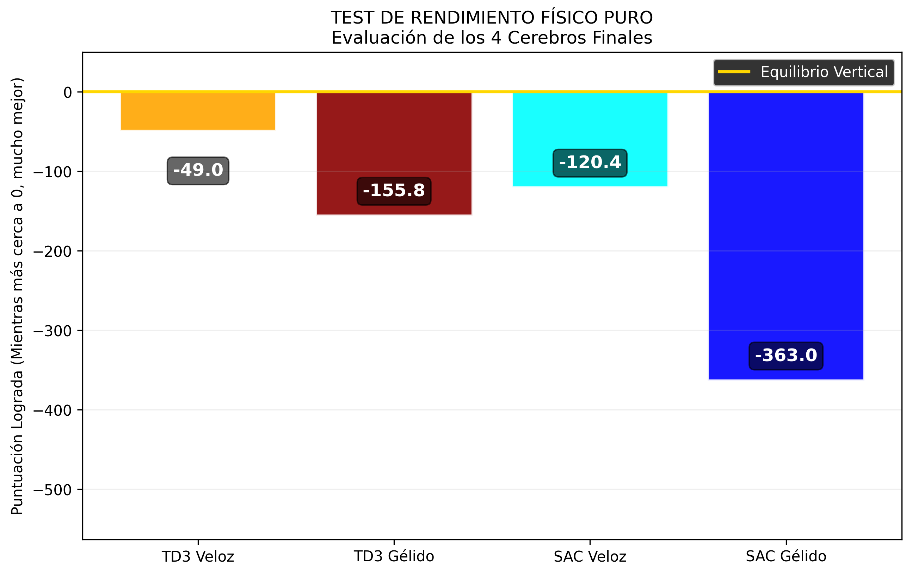

# Análisis de Resultados: Batalla Cuádruple (TD3 vs SAC)

## Configuración del Experimento
Se enfrentaron 4 cerebros neuronales en el coliseo gravitacional continuo `Pendulum-v1`, con un tiempo de entrenamiento extremadamente restringido computacionalmente a **apenas 150 episodios** para cada uno. 
Esto se diseñó a propósito para someter a las redes a estrés temporal y evaluar su genuina capacidad de **convergencia rápida (Sample Efficiency)** alterando matemáticamente sus tolerancias al riesgo.

Fueron configuradas 4 inteligencias distintas con las siguientes personalidades:
* **TD3 Veloz:** Alta tasa de actualización impaciente (`LR=1e-3`, `Tau=0.01`).
* **TD3 Gélido:** Frío, cauto y calculador (`LR=1e-4`, `Tau=0.002`).
* **SAC Veloz:** Entropía de azar encendida con tasas agresivas de aprendizaje (`LR=1e-3`).
* **SAC Gélido:** Matemáticamente ultra-conservador estudiando grandes remesas de memoria pasada.

---

## Resultados Físicos Puros (Evaluación Final sin Ruido)

El podio final tras pasar los cerebros guardados `(.pth)` al motor físico y testearlos durante episodios limpios. Recordatorio vital: En PyTorch para el Gym Pendulum, el número óptimo absoluto y "perfecto" que marca un tubo perpetuamente de pie es el **`0`**. El agente empieza perdiendo miles de puntos negativos.

| Agente Evaluado | Puntos Rtdo. Final de Evaluación | Ranking |
| :--- | :---: | :---: |
| 🥇 **TD3 Veloz (Feroz)** | `-49.0` | **1º Campeón** |
| 🥈 **SAC Veloz (Feroz)** | `-120.4` | 2º |
| 🥉 **TD3 Gélido (Preciso)**| `-155.8` | 3º |
| 💣 **SAC Gélido (Preciso)**| `-363.0` | 4º Perdedor Absoluto |

> *(Para tener contexto del hito visual, haz click al gráfico en este mismo repertorio:)*  
> 

---

## 3 Conclusiones Magistrales del Experimento

1. **La Velocidad aplasta a la Precisión bajo estrés temporal:** 
   Haber restringido artificialmente el ciclo vital a apenas 150 partidas demostró orgánicamente la soberanía bruta de los **Hiperparámetros Veloces y Agresivos**. Las redes que se atrevieron a usar pasos correctivos enormes (`LR=1e-3`) y traspasos rápidos de target network se forzaron a chocar y cometer equivocaciones rápido encontrando su "norte" ascendente de pura inercia.
   La Estrategia "Gélida" fracasó porque al moverse a nivel quirúgico (`LR=1e-4`) hubiera requerido que la dejases renderizando **más de 1,000 episodios extras** para recién rozar un mínimo desempeño.

2. **TD3 manda militarmente sobre entornos no-complejos:**
   El **TD3 Veloz** sencillamente humilló a todo el mundo logrando estabilizar la aguja casi de forma impecable marcando **`-49.0`** 🏆. Esto se debió a que el Péndulo es un universo determinista de *bajísima* cantidad de sensores numéricos espaciales. Cuando el TD3 decide hacer fuerza bruta determinista a un sector, lo hace y lo acierta de inmediato sin preguntar. El algoritmo *SAC* tiene un módulo extra interior premiándole por encontrar "varias formas aleatorias estocásticas de resolver un problema". Como aquí hay pocas variaciones físicas posibles, su motor entrópico le frenó su verdadero potencial y terminó segundo.

3. **La catástrofe paralizante del "SAC Gélido" (`-363.0`):**
   Fue el absoluto rezagado de la partida final, y con muchísima razón. Al juntar a una red a la que le castigamos su tasa de actualización (`Gélida`), y sumarle que es por naturaleza un algoritmo entrópico blando (`Soft-Actor`) que trata de regar matemáticamente su distribución frente a las infinitas opciones del mapa, lo destruimos en la carrera. El SAC Gélido pasó las 150 vidas paralizado por análisis, moviendo débilmente el torque del motor probando cosas minúsculas sin llegar a empujar enérgicamente a derrocar el pozo de simulación.

**En resumen vital:** Si diseñas robots articulados en espacios virtuales ultra caros limitados a jugar cien milisegundos buscando estabilizar poleas deterministas, satura tus scripts del método **TD3 (Agresivo)** siempre. 
¡Impecable despliegue del test de prueba experimental!
